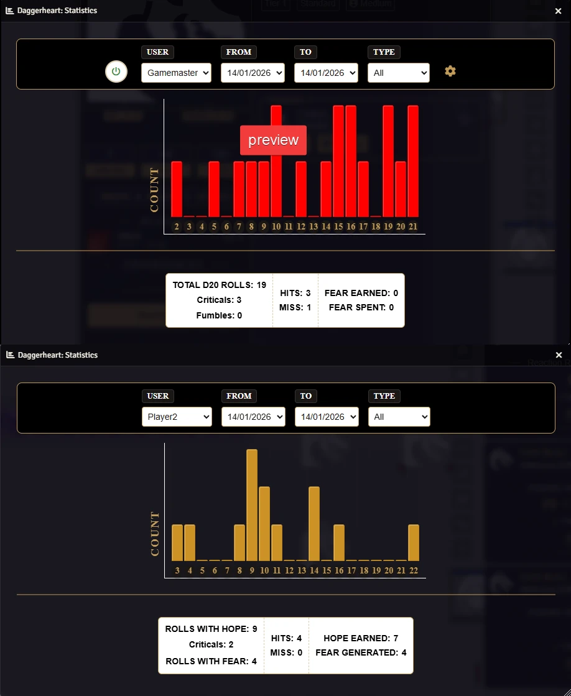
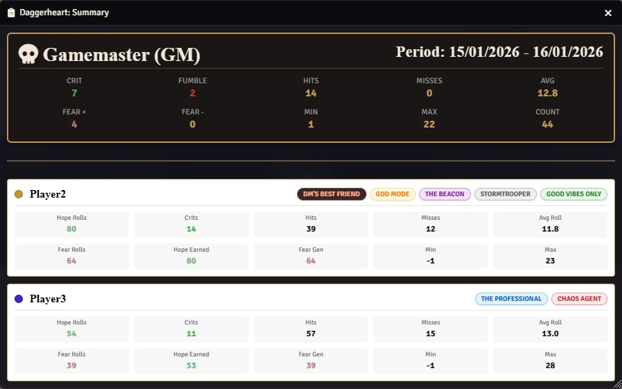
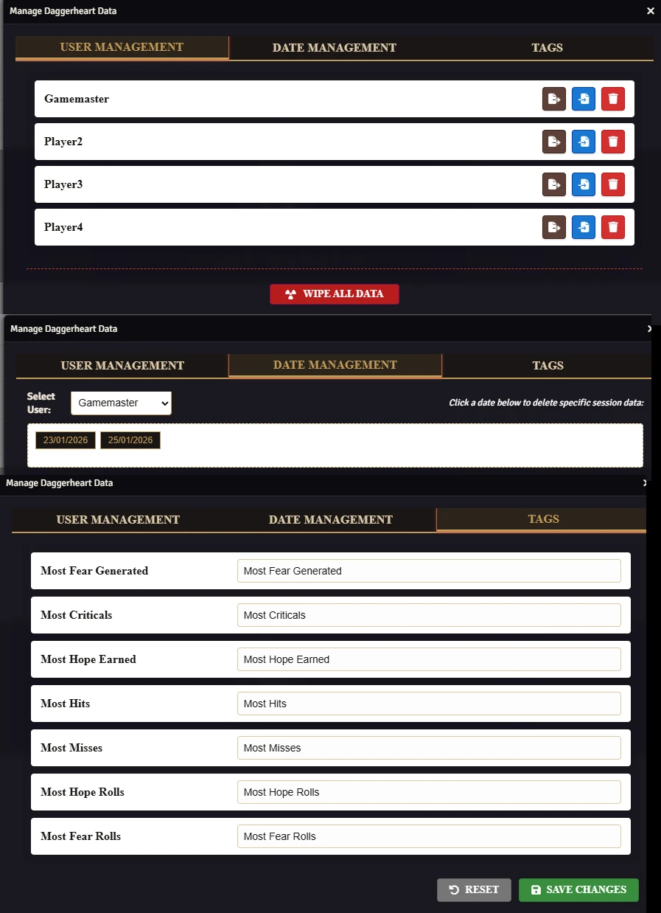

# Daggerheart: Statistics

<p align="center"></p>

## What is it?
This module tracks rolls made by the GM (d20) and the players (Duality Dice). It automatically calculates Fear gains, critical hits, and rolls involving Hope and Fear.

## Why?
Reviewing the session's dice rolls is a great way to wrap up the night. Additionally, GMs can use this data to spot players who struggled with poor rolls and may need a special moment in the upcoming session.

<p align="center"></p>

<p align="center"></p>

## 🚀 Key Features

* **Automated Roll Tracking:** Automatically captures and logs D20 rolls, Duality Dice (Hope/Fear), and Critical Successes.

* **Visual Charts:** Displays an interactive bar chart of roll distributions, allowing users to visualize probability trends.

* **Detailed Statistics:**

  * **For GMs:** Tracks Total Rolls, Criticals, Fumbles, Fear Earned/Spent, and Hits/Misses.

  * **For Players:** Tracks Hope/Fear rolls, Criticals, Hits/Misses, and Hope Earned/Fear Generated from Action Rolls.

* **Data Management:** Powerful tools for the GM to Export (JSON), Import, and Delete user data, including a "Full Wipe" option.

* **Filtering:** Filter statistics by Date Range and Roll Type (Action, Reaction, or All).

* **Privacy Controls:** Settings to control visibility of hidden rolls and GM statistics for players.

## 🛠️ How to Use

1. **Access:** Click the "Chart" icon in the Token Controls (left sidebar) or the "Stats" button in the Daggerheart System Menu (right sidebar). You can use a macro too: 

```js
DaggerheartStats.Open();
```

2. **Recording:** Ensure the "Pause Data Acquisition" setting is OFF (default). The module automatically listens to chat rolls.

3. **Management:** GMs can access the management panel via the "Gear" icon inside the main statistics window to handle data maintenance.

<p align="center"></p>

Learn more at [WIKI](https://github.com/brunocalado/daggerheart-stats/wiki)

## 🚀 Installation

Install via the Foundry VTT Module browser or use this manifest link:

```js
https://raw.githubusercontent.com/brunocalado/daggerheart-stats/refs/heads/main/module.json
```

## ⚖️ Credits

* **Code License:** GNU GPLv3.

* **Assets:** AI Audio and images provided are [CC0 1.0 Universal Public Domain](https://creativecommons.org/publicdomain/zero/1.0/).

**Disclaimer:** This module is an independent creation and is not affiliated with Darrington Press. This product includes materials from the Daggerheart System Reference Document 1.0, Critical Role, LLC. under the terms of the Darrington Press Community Gaming (DPCGL) License. More information can be found at [https://www.daggerheart.com](https://www.daggerheart.com).

# 🧰 My Daggerheart Modules

| Module | Description |
| :--- | :--- |
| 💀 [**Adversary Manager**](https://github.com/brunocalado/daggerheart-advmanager) | Scale adversaries instantly and build balanced encounters in Foundry VTT. |
| 💥 [**Critical**](https://github.com/brunocalado/daggerheart-critical) | Animated Critical. |
| 💠 [**Custom Stat Tracker**](https://github.com/brunocalado/dh-new-stat-tracker) | Add custom trackers to actors. |
| ☠️ [**Death Moves**](https://github.com/brunocalado/daggerheart-death-moves) | Enhances the Death Move moment with immersive audio and visual effects. |
| 📏 [**Distances**](https://github.com/brunocalado/daggerheart-distances) | Visualizes combat ranges with customizable rings and hover calculations. |
| 🤖 [**Fear Macros**](https://github.com/brunocalado/daggerheart-fear-macros) | Automatically executes macros when the Fear resource is changed. |
| 😱 [**Fear Tracker**](https://github.com/brunocalado/daggerheart-fear-tracker) | Adds an animated slider bar with configurable fear tokens to the UI. |
| 🎲 [**Stats**](https://github.com/brunocalado/daggerheart-stats) | Tracks dice rolls from GM and Players. |
| 🧠 [**Stats Toolbox**](https://github.com/brunocalado/dh-statblock-importer) | Import using a statblock. |
| 🛒 [**Store**](https://github.com/brunocalado/daggerheart-store) | A dynamic, interactive, and fully configurable store for Foundry VTT. |
| 📦 [**Extra Content**](https://github.com/brunocalado/daggerheart-extra-content) | Homebrew for Daggerheart. |
| ⚡ [**Quick Actions**](https://github.com/brunocalado/daggerheart-quickactions) | Quick access to common mechanics like Falling Damage, Downtime, etc. |
| 📜 [**Quick Rules**](https://github.com/brunocalado/daggerheart-quickrules) | Fast and accessible reference guide for the core rules. |

# 🗺️ Adventures

| Adventure | Description |
| :--- | :--- |
| ✨ [**I Wish**](https://github.com/brunocalado/i-wish-daggerheart-adventure) | A wealthy merchant is cursed; one final expedition may be the only hope. |
| 💣 [**Suicide Squad**](https://github.com/brunocalado/suicide-squad-daggerheart-adventure) | Criminals forced to serve a ruthless master in a land on the brink of war. |